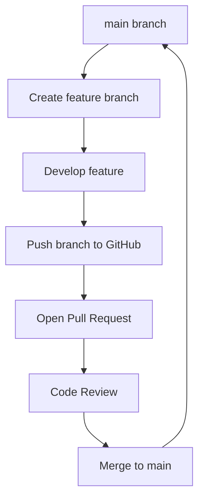

# Branching Workflow

## Concept

Branching workflow uses branches for isolated development.

## Explanation

Each feature or fix gets its own branch to avoid conflicts.

## Example

Create branch, work, merge via PR.

## Command

```bash
git checkout -b feature
# work
git push origin feature
# open PR
```

## Use case

Open-source projects use branching for contributions.

## Workflow Diagram

