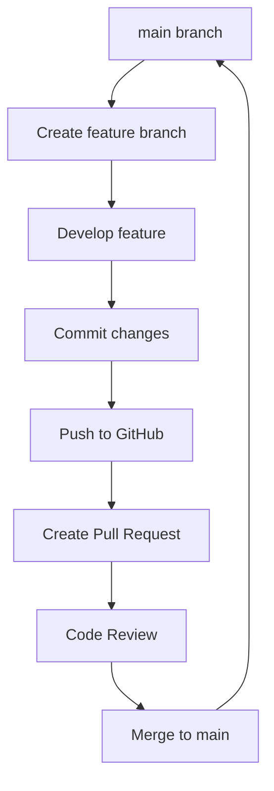

# Git Workflow

## Concept

Git workflow organizes development with branches and reviews.

## Explanation

Structured workflows ensure quality and collaboration.

## Example

Create branch, develop, open PR, review, merge.

## Command

```bash
git checkout -b feature
# develop
git push origin feature
gh pr create --title "Feature" --body "Details"
```

## Use case

Teams use workflows to manage code changes and maintain quality.

## Workflow Diagram



## Advanced Workflow Patterns

### Git Flow
- `main`: Production-ready code
- `develop`: Integration branch
- `feature/*`: Feature branches
- `release/*`: Release preparation
- `hotfix/*`: Emergency fixes

### Pull Request Best Practices
- Keep PRs small and focused
- Write clear descriptions
- Request reviews from team members
- Use checklists for consistency
⬅️ Back to [Home](../../index.md)
